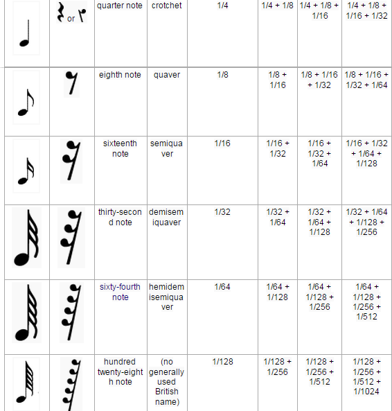
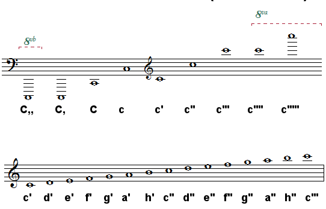

# The Mi programming language


Mi is a small percussion music programming language for fun.
I'm a big fan of music (percussion more precisely) and programming, why not merge the two ?
I don't want programming to replace music software because these software is much more suitable and offers much more tools for music but I find it fun to play music by coding.

- [Installation](#installation)
- [Compiling](#compiling)
- [Example](#example)
- [Syntax](#syntax)
    - [Durations of notes](#durations-of-notes)
    - [Octaves](#octaves)

## Installation

To install Mi:

`gem install mi`

And verifying that it works:

`mi --version`

## Compiling

To create a MIDI file:

`mi -o --midi sample.mi`

To create PDF file:

`mi -o --pdf sample.mi`

## Example

This is a simple syntax example:

```
(tempo: 120)

(Xylophone
    [D _ _ D G]
stop)
```

`tempo` it's the tempo you want in your piece

`Xylophone` it's the percussion you want to play

it is between `[]` that we place notes, rhythms, ...

`_` it's a silence

`stop` to finish the piece

### Syntax

The Mi syntax is meant to be simple enough to understand.

## Durations of notes



In Mi we must specify the duration of the note before this one:

```
[1/8F] 
```

`1/8` it's a quaver  

<br><br>
## Octaves



Mi uses the Helmholtz notation system to indicate octaves:

```
[c' g'' C,, c''''']  
```

<br><br>

### Roadmap

- [x] Grammar
- [ ] Parser
    - [ ] Lexer
    - [ ] Parser
